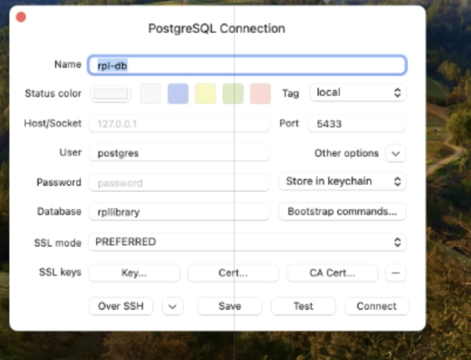
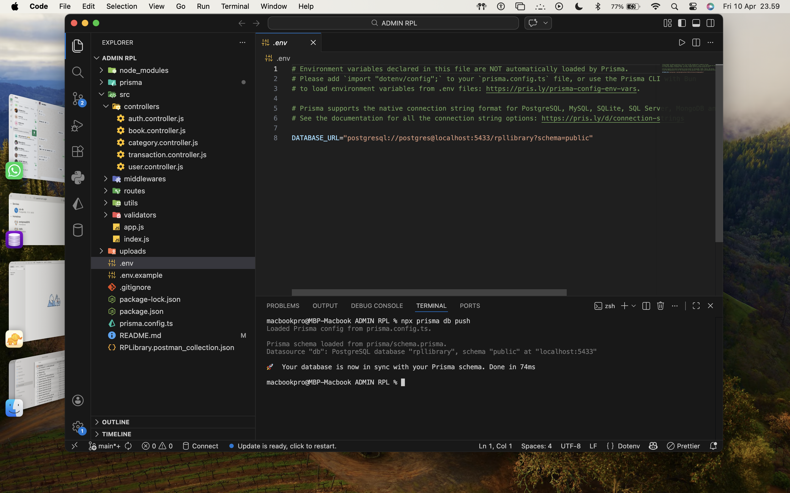
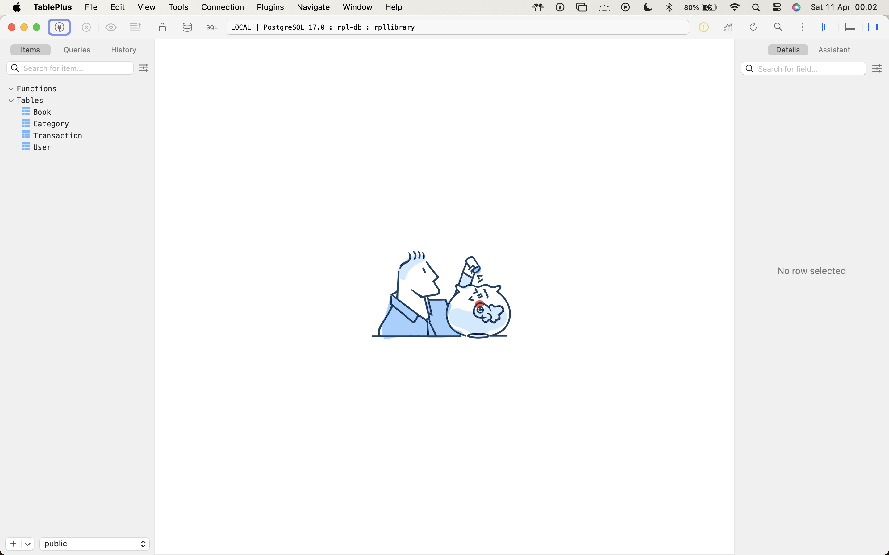
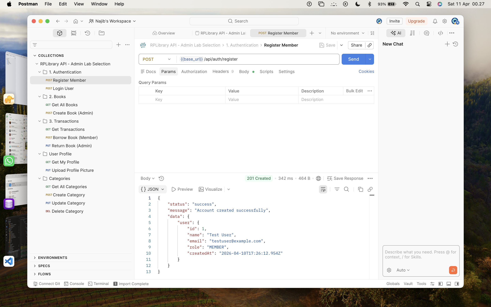
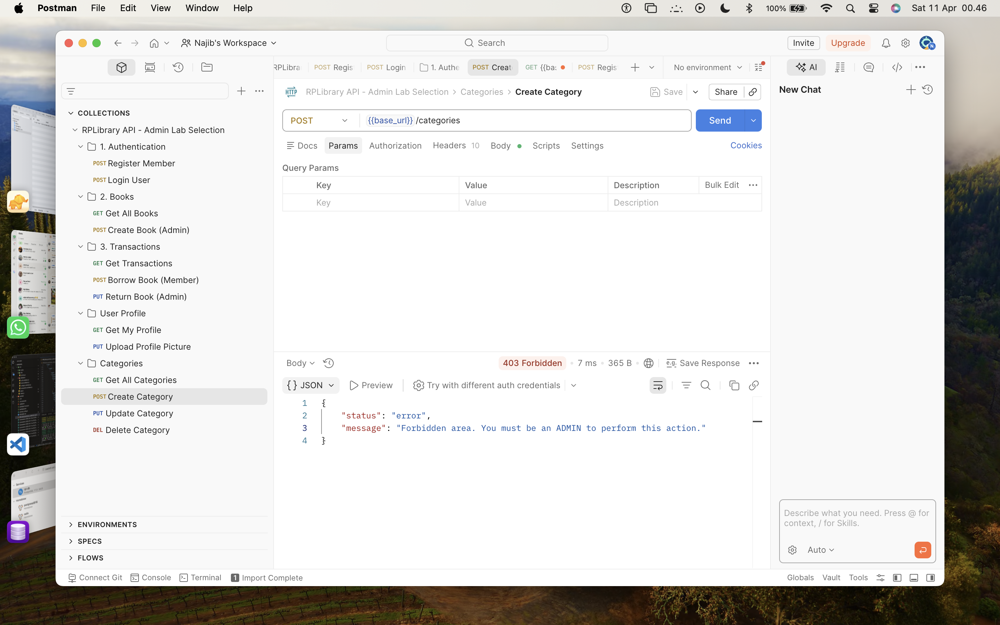
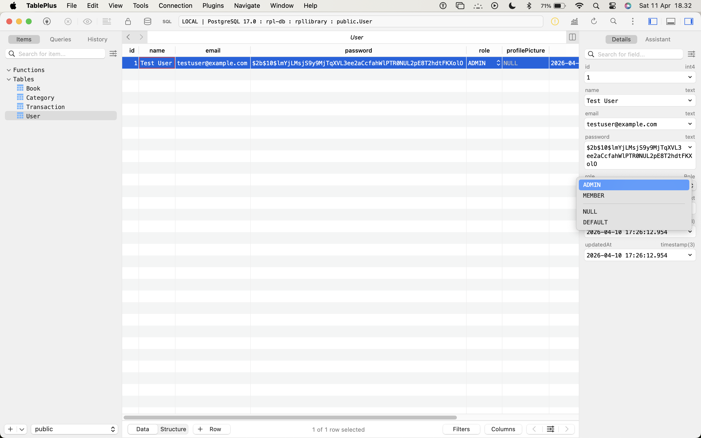
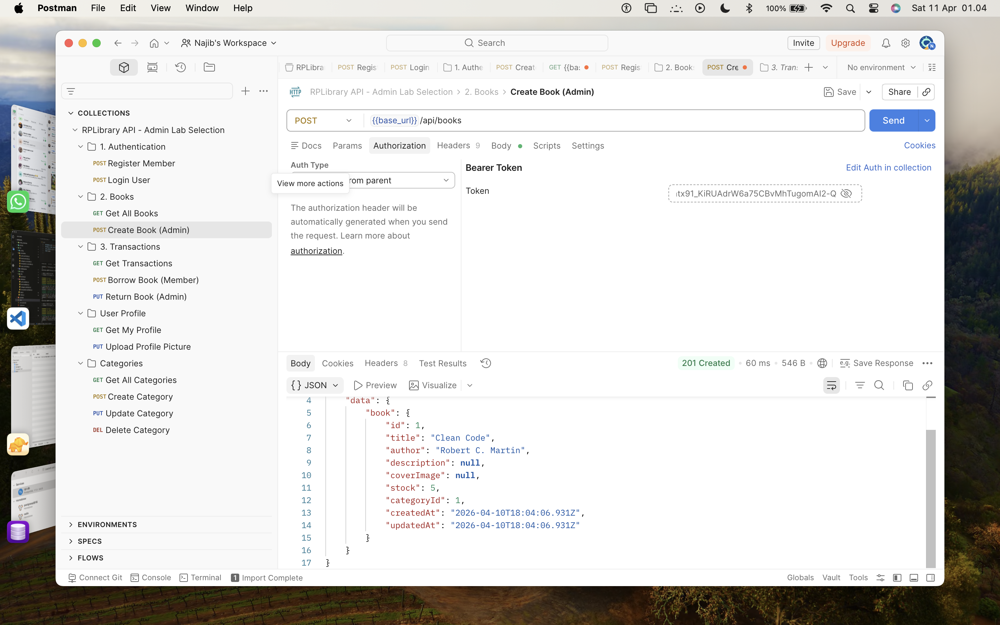
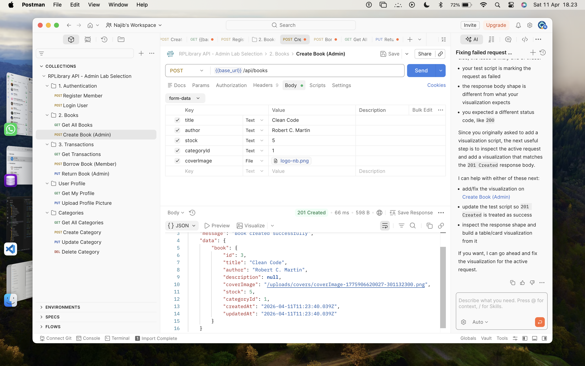
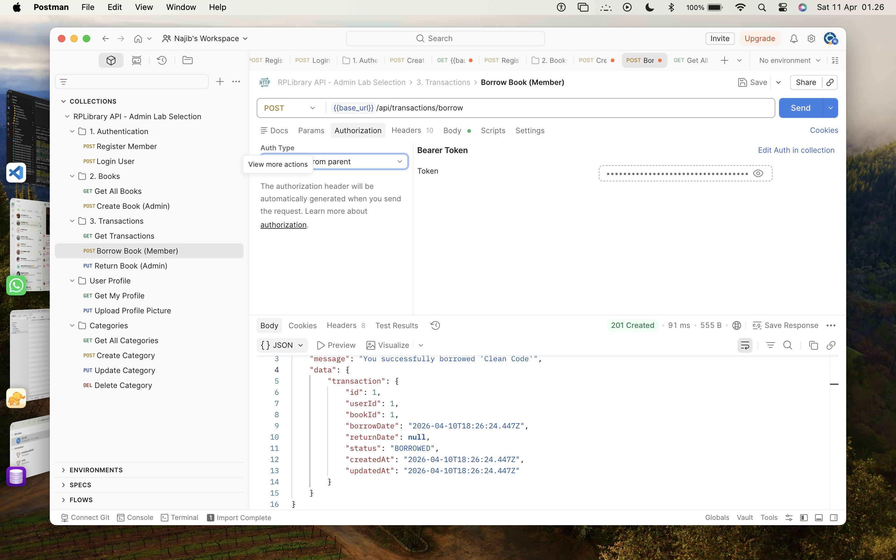
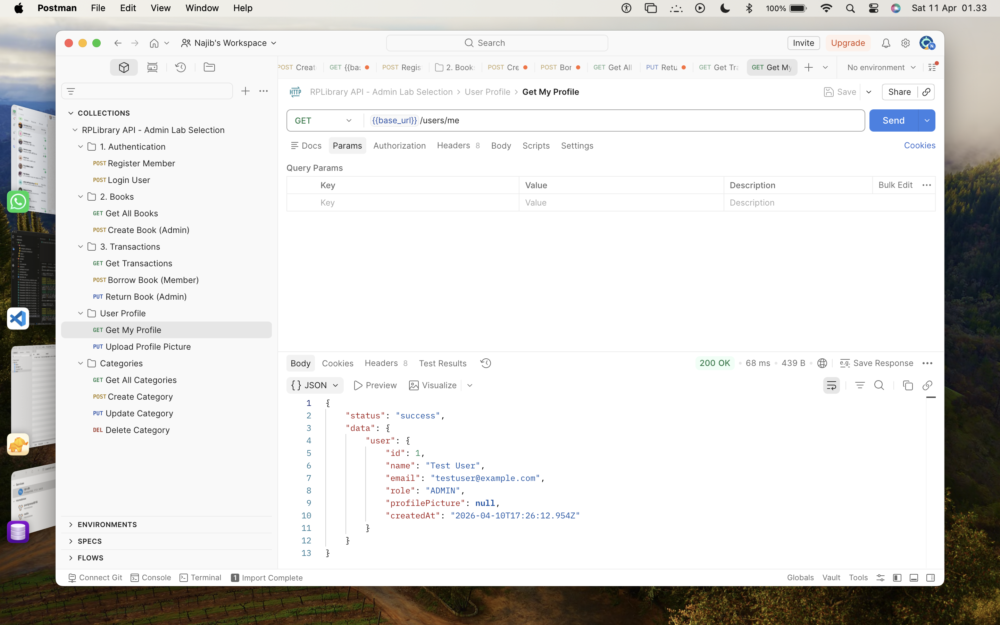

# RPLibrary Backend API 📚🚀

Proyek ini adalah API backend untuk sistem manajemen perpustakaan **RPLibrary**, dibuat khusus untuk menuntaskan evaluasi **Seleksi Admin Lab RPL 2026**. Proyek ini dioptimalkan untuk lingkungan **macOS** (misalnya menggunakan library `bcryptjs` agar kompilasi native Mac aman) dan dilengkapi dengan Arsitektur Modular, validasi berbasis `Zod`, upload file via `Multer`, serta `PostgreSQL` lewat Prisma ORM.

## Tech Stack
- **Runtime**: Node.js v20+
- **Framework**: Express.js
- **ORM**: Prisma ORM
- **Database**: PostgreSQL / MySQL
- **Validation**: Zod
- **Auth**: JWT (JSON Web Token) & `bcryptjs`
- **File Upload**: Multer

### 💡 Justifikasi Pemilihan Tech Stack
Pemilihan stack ini didasarkan pada efisiensi pengembangan dan keamanan sistem:
1. **Express.js**: Framework minimalis yang sangat fleksibel untuk arsitektur modular, memudahkan pemisahan antara router, controller, dan middleware.
2. **Prisma ORM**: Memberikan *Type-safety* yang kuat, memudahkan manajemen migrasi database, dan mencegah kesalahan query manual (SQL Injection protection).
3. **bcryptjs**: Dipilih karena fungsionalitasnya yang stabil di berbagai OS (terutama macOS) tanpa ketergantungan pada native build tools yang kompleks seperti `bcrypt` standar.
4. **Zod**: Digunakan sebagai *validation schema* tunggal baik untuk *Environment Variables* maupun *Request Body*, memastikan data yang masuk ke sistem selalu valid dan bersih.
5. **JWT (JSON Web Token)**: Standar industri untuk autentikasi *stateless*, memungkinkan skalabilitas aplikasi di masa depan.

---

## 🛠 Instalasi & Cara Menjalankan Server di macOS

### 1. Persiapan Database (Mac)
Anda disarankan menggunakan **DBngin** untuk menyalakan server PostgreSQL/MySQL lokal, dan **TablePlus** untuk melihat datanya.
- Buka **DBngin**, buat server PostgreSQL baru lalu Start.
- Catat port (biasanya `5432`).
- Buka **TablePlus**, koneksikan, dan buat database baru bernama `rplibrary`.

### 2. Konfigurasi Proyek
1. Buka Terminal dan clone repository ini / masuk ke foldernya.
2. Install semua dependency:
   ```bash
   npm install
   ```

3. Buat file `.env` berdasarkan contoh yang telah saya buat di `.env.example`.
   Sesuaikan `DATABASE_URL` jika password root di DBngin Anda berbeda (default DBngin MacOS biasanya username `root` no password, tapi di `.env.example` saya anggap general).
   ```bash
   cp .env.example .env
   ```

### 3. Setup Database (Prisma Migrations)
Jalankan perintah ini agar Prisma membuat tabel (User, Book, Category, Transaction) ke dalam database secara otomatis:
```bash
npx prisma db push
```

*(Opsional) Jika ingin memasukkan data dummy (Seeding), Anda dapat memasukkan baris manual via TablePlus terlebih dahulu sebelum fitur tambah buku dipakai.*

### 4. Jalankan Aplikasi
Aplikasi sudah dikonfigurasi dengan `nodemon` agar server restart otomatis saat ada perubahan kode:
```bash
npm run dev
```

Jika muncul `🚀 RPLibrary API is running perfectly on http://localhost:3000`, maka server sudah siap dipakai! 🎉

---

## 📌 Endpoint API

Berikut adalah daftar endpoint. **Gunakan file `RPLibrary.postman_collection.json` untuk testing yang instan tanpa harus set manual.**

### 1. Authentication
| Method | Endpoint | Description | Access |
| ------ | -------- | ----------- | ------ |
| POST | `/api/auth/register` | Mendaftarkan akun member baru. | Public |
| POST | `/api/auth/login` | Login user (Admin / Member). | Public |

### 2. Books Management
| Method | Endpoint | Description | Access |
| ------ | -------- | ----------- | ------ |
| GET | `/api/books` | Melihat seluruh buku. Bisa filter `?title=` atau `?categoryId=`. | Public |
| POST | `/api/books` | Menambah buku (Form Data `coverImage`). | Admin |
| PUT | `/api/books/:id` | Mengubah buku (beserta ganti cover). | Admin |
| DELETE | `/api/books/:id` | Menghapus buku beserta file cover. | Admin |

### 3. Borrowing System (Transaction)
| Method | Endpoint | Description | Access |
| ------ | -------- | ----------- | ------ |
| GET | `/api/transactions` | Melihat riwayat transaksi (Admin: Semua, Member: Milik sendiri). | Admin / Member |
| POST | `/api/transactions/borrow` | Meminjam buku (Otomatis kurangi stock). | Member |
| PUT | `/api/transactions/:id/return` | Mengonfirmasi klaim pengembalian (Stock kembali bertambah). | Admin |

---

### 5. Pengujian API dengan Postman

Agar pengujian lebih mudah, sebuah file konfigurasi Postman Collection telah disertakan:

1. Buka aplikasi **Postman**.
2. Klik **Import** -> Pilih file `RPLibrary.postman_collection.json` yang ada di root direktori proyek ini.
3. Di dalam collection tersebut, Anda akan menemukan daftar endpoint Auth, Books, Transactions, dll.
4. **Penting (Authorization)**: Setiap request mewarisi Token dari setting collection (`Inherit auth from parent`). Pastikan untuk menyalin token JWT hasil **Login** ke tab Authorization (pilih Bearer Token) di tingkat Collection atau pada request yang bersangkutan.

### 6. Cara Upload Cover Image di Postman (atau menggunakan cURL)
Jika ingin menguji upload foto untuk penambahan Buku atau Ganti Profil, pastikan Anda menggunakan **form-data** pada Postman:
1. Masuk ke request (misal: POST `/api/books` atau PUT `/api/users/me/profile-picture`).
2. Masuk ke tab **Body** lalu pilih **form-data**.
3. Di kolom KEY, ketik `coverImage` (untuk buku) atau `profileImage` (untuk profil).
4. Ubah tipe KEY dari `Text` menjadi `File` di dropdown sebelah kanan tulisan KEY.
5. Klik **Select Files** lalu cari gambar yang ingin diupload. Isikan data lainnya seperti biasa.
6. Lalu tekan **Send**.

Atau, jika menggunakan terminal (cURL), contoh eksekusinya:
```bash
curl -X POST http://localhost:3000/api/books \
  -H "Authorization: Bearer <TOKEN_ADMIN>" \
  -F "title=Belajar Node.js" \
  -F "stock=10" \
  -F "categoryId=1" \
  -F "coverImage=@/lokasi/gambar/komputer/anda.jpg"
```

---

## 📸 Bukti Implementasi & Pengujian

Berikut ini adalah rangkaian screenshot beserta langkah-langkah yang membuktikan fungsionalitas dan konfigurasi database dari proyek RPLibrary.

---

### Tahap 1: Persiapan Database & Server

**1. DBngin PostgreSQL Berjalan di Port 5433**


> **Cara Setup:**
> 1. Buka aplikasi **DBngin** di Mac.
> 2. Klik tombol **`+`** untuk membuat server baru.
> 3. Pilih **PostgreSQL**, beri nama (misal: `rpl-db`), dan atur port yang tersedia (misal: `5433`).
> 4. Klik **Start** hingga indikator berubah hijau.

---

**2. Koneksi ke TablePlus**


> **Cara Setup:**
> 1. Buka aplikasi **TablePlus**.
> 2. Klik **Create a new connection** -> pilih **PostgreSQL**.
> 3. Isi konfigurasi:
>    - **Name**: `rpl-db`
>    - **Host**: `127.0.0.1`
>    - **Port**: `5433` (sesuaikan dengan port DBngin)
>    - **User**: `postgres`
>    - **Password**: `password` (atau sesuai konfigurasi DBngin)
>    - **Database**: `rpllibrary`
> 4. Klik **Test** untuk memastikan koneksi berhasil, lalu klik **Connect**.

---

**3. Konfigurasi Environment & Push Prisma**


> **Cara Setup:**
> 1. Sesuaikan file `.env` dengan koneksi database Anda (lihat `.env.example` sebagai template).
> 2. Buka Terminal di folder proyek, lalu jalankan:
>    ```bash
>    npx prisma db push
>    ```
> 3. Jika berhasil, akan muncul pesan: `🚀 Your database is now in sync with your Prisma schema.`
> 4. Tabel **User**, **Book**, **Category**, dan **Transaction** akan otomatis terbuat di database.

---

**4. TablePlus — Koneksi Berhasil & Database Kosong (Ready)**


> **Verifikasi:**
> 1. Buka kembali **TablePlus** dan klik koneksi `rpl-db`.
> 2. Di panel kiri, Anda akan melihat 4 tabel: **Book**, **Category**, **Transaction**, **User**.
> 3. Semua tabel masih kosong — artinya database siap untuk diisi melalui API.

---

**5. Server Berjalan Normal (`npm run dev`)**


> **Cara Menjalankan:**
> 1. Buka Terminal di folder proyek, lalu jalankan:
>    ```bash
>    npm run dev
>    ```
> 2. Jika berhasil, akan muncul pesan:
>    `[SERVER] 🚀 RPLibrary API is running perfectly on http://localhost:3000`
> 3. Server menggunakan **nodemon** sehingga akan restart otomatis saat ada perubahan kode.

---

### Tahap 2: Autentikasi Pengguna

**6. Register Member Berhasil (POST `/api/auth/register`)**


> **Cara Test di Postman:**
> 1. Buka Postman, import file `RPLibrary.postman_collection.json`.
> 2. Masuk ke folder **1. Authentication** -> klik **Register Member**.
> 3. Di tab **Body** -> pilih **raw** (JSON), isi data seperti:
>    ```json
>    {
>      "name": "Najib",
>      "email": "najib@mail.com",
>      "password": "password123"
>    }
>    ```
> 4. Klik **Send**. Response `201 Created` menandakan registrasi berhasil.
> 5. Secara default, akun baru akan memiliki role **MEMBER**.

---

**7. Login Berhasil & Mendapatkan JWT Token (POST `/api/auth/login`)**


> **Cara Test di Postman:**
> 1. Masuk ke folder **1. Authentication** -> klik **Login User**.
> 2. Di tab **Body** -> pilih **raw** (JSON), isi:
>    ```json
>    {
>      "email": "najib@mail.com",
>      "password": "password123"
>    }
>    ```
> 3. Klik **Send**. Anda akan mendapatkan response berisi **token JWT**.
> 4. **Copy token tersebut** — token ini diperlukan untuk mengakses endpoint yang dilindungi (Protected Routes).

---

**8. Konfigurasi Authorization Postman (`Inherit From Parent`)**


> **Cara Setup Token di Postman:**
> 1. Klik nama Collection **RPLibrary API** di sidebar kiri.
> 2. Masuk ke tab **Authorization**.
> 3. Pilih Type: **Bearer Token**.
> 4. Paste token JWT yang sudah di-copy dari langkah Login ke kolom **Token**.
> 5. Klik **Save**.
> 6. Untuk setiap request di bawah collection ini, pastikan Authorization di-set ke **Inherit auth from parent** agar otomatis menggunakan token dari Collection.

---

### Tahap 3: Role-Based Access & Manajemen Entitas

**9. Pengujian Role: Gagal Create Category karena Bukan ADMIN**


> **Penjelasan:**
> 1. Saat mencoba **Create Category** dengan akun yang role-nya masih **MEMBER**, server akan menolak dengan response `403 Forbidden`.
> 2. Ini membuktikan bahwa sistem **Role-Based Access Control (RBAC)** berfungsi dengan benar.
> 3. Untuk bisa mengakses fitur Admin seperti Create Category dan Create Book, kita perlu mengubah role user menjadi **ADMIN** melalui database.

---

**🔑 Switch Role ke ADMIN melalui TablePlus**


> **Cara Mengubah Role ke ADMIN:**
> 1. Buka **TablePlus**, masuk ke koneksi database `rpllibrary`.
> 2. Klik tabel **User** di panel kiri.
> 3. Cari baris user yang ingin dijadikan Admin (berdasarkan kolom **name** atau **email**).
> 4. **Double-klik** pada kolom **role** di baris user tersebut.
> 5. Ubah nilai dari `MEMBER` menjadi `ADMIN`.
> 6. Tekan **Cmd + S** untuk menyimpan perubahan ke database.
> 7. **Penting**: Setelah mengubah role, Anda perlu **Login ulang** di Postman untuk mendapatkan token baru yang sudah memiliki role ADMIN. Lalu update token di Collection Authorization.

---

**10. Admin Berhasil Membuat Kategori (POST `/api/categories`)**


> **Cara Test di Postman:**
> 1. Pastikan Anda sudah **Login ulang** setelah mengubah role ke ADMIN dan sudah update token di Collection.
> 2. Masuk ke folder **Categories** -> klik **Create Category**.
> 3. Di tab **Body** -> pilih **raw** (JSON), isi:
>    ```json
>    {
>      "name": "Programming"
>    }
>    ```
> 4. Klik **Send**. Response `201 Created` menandakan kategori berhasil dibuat.

---

**11. Admin Berhasil Membuat Buku (POST `/api/books`)**


> **Cara Test di Postman:**
> 1. Masuk ke folder **2. Books** -> klik **Create Book (Admin)**.
> 2. Di tab **Body** -> pilih **form-data**.
> 3. Isi field berikut:
>    - `title` (Text): `Clean Code`
>    - `author` (Text): `Robert C. Martin`
>    - `stock` (Text): `5`
>    - `categoryId` (Text): `1`
> 4. Klik **Send**. Response `201 Created` menandakan buku berhasil ditambahkan.

---

**12. Upload Cover Image Buku Berhasil via Form-Data (POST `/api/books`)**


> **Cara Upload Gambar di Postman:**
> 1. Masih di request **Create Book (Admin)**, di tab **Body** -> **form-data**.
> 2. Tambahkan field baru: ketik `coverImage` di kolom **Key**.
> 3. **Penting**: Arahkan kursor ke ujung kanan field `coverImage`, ubah tipe dari **Text** menjadi **File** di dropdown.
> 4. Setelah diubah ke `File`, akan muncul tombol **Select Files**. Klik dan pilih gambar dari komputer.
> 5. Isi field lainnya (title, author, stock, categoryId) lalu klik **Send**.
> 6. Response akan menunjukkan path file di kolom `coverImage`, misalnya `/uploads/covers/xxxxx.png`.
> 7. File gambar asli tersimpan di folder `uploads/covers/` dalam proyek.

---

### Tahap 4: Sistem Transaksi & Profil

**13. Member Berhasil Meminjam Buku (POST `/api/transactions/borrow`)**


> **Cara Test di Postman:**
> 1. Untuk meminjam buku, Anda harus login sebagai **MEMBER** (bukan ADMIN). Anda bisa register akun baru atau ubah kembali role di TablePlus.
> 2. Masuk ke folder **3. Transactions** -> klik **Borrow Book (Member)**.
> 3. Di tab **Body** -> pilih **raw** (JSON), isi:
>    ```json
>    {
>      "bookId": 1
>    }
>    ```
> 4. Klik **Send**. Response `201 Created` menandakan peminjaman berhasil.
> 5. Stok buku akan **otomatis berkurang 1** di database.

---

**14. Admin Mengonfirmasi Pengembalian Buku (PUT `/api/transactions/:id/return`)**


> **Cara Test di Postman:**
> 1. Login kembali sebagai **ADMIN** (atau gunakan token admin).
> 2. Masuk ke folder **3. Transactions** -> klik **Return Book (Admin)**.
> 3. Di URL, ganti `:id` dengan ID transaksi yang ingin dikembalikan (misal: `/api/transactions/1/return`).
> 4. Klik **Send**. Response `200 OK` menandakan pengembalian berhasil dikonfirmasi.
> 5. Stok buku akan **otomatis bertambah 1** kembali di database.

---

**15. Mengambil Semua Daftar Buku (GET `/api/books`)**


> **Cara Test di Postman:**
> 1. Masuk ke folder **2. Books** -> klik **Get All Books**.
> 2. Endpoint ini bersifat **Public** sehingga tidak perlu token.
> 3. Klik **Send**. Semua data buku yang telah ditambahkan akan ditampilkan.
> 4. Anda juga bisa menambahkan filter: `?title=Clean` atau `?categoryId=1` di URL.

---

**16. Fitur Melihat Profil Sendiri (GET `/api/users/me`)**


> **Cara Test di Postman:**
> 1. Masuk ke folder **User Profile** -> klik **Get My Profile**.
> 2. Pastikan sudah login dan memiliki token yang valid.
> 3. Klik **Send**. Response akan menampilkan data profil user yang sedang login (name, email, role).
> 4. Endpoint ini bisa diakses oleh **ADMIN** maupun **MEMBER** — masing-masing hanya melihat profil milik sendiri.

---

*Dibuat oleh Tim Spesial untuk Seleksi Admin Lab RPL ITS 2026. Deployment Readiness Checked! 🎉*

